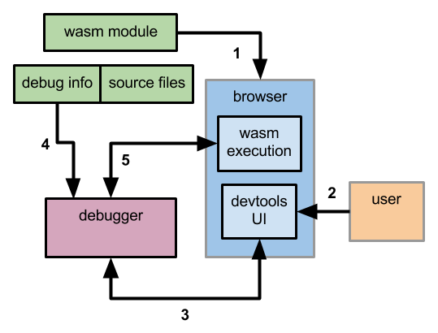

#WebAssembly Debugging

This is a design proposal for enabling source-level debugging of WebAssembly
modules.

## Introduction

There are several entities involved in debugging a source program compiled into
WebAssembly:

- the compiled code being executed, called the _debuggee_
- the browser engine executing the debuggee
- the browser devtools
- the source-program listing, usually split into multiple source files
- the description of how the debuggee code maps to the source program and vice
  versa (e.g., WebAssembly code locations to source code locations, source
  variables to WebAssembly memory, WebAssembly call stack to source functions,
  etc.), called the _debug info_

These entities carry information and interact in particular ways to enable a
user to perform debugging actions at the source-code level.  For example, the
browser devtools offer a UI allowing the user to step through the source code,
requiring partial execution of the debuggee chunk corresponding to each step,
and displaying the source file containing the stepped-through program.

Specifying the debugging framework means describing how these entities interact,
what they need from each other, and how they access it; all in order to execute
the user's commands.

## Debugger as a Procedural Interface

A crucial element of this design proposal is to omit specifying a particular
format for the debug info.  Instead, we introduce a separate entity we call the
debugger; its job is to act as a procedural intermediary between the devtools
and the debug info.  Devtools execute user actions by leveraging debugger
methods we will specify here.

Thus any debug-info format is acceptable, as long as the debugger can correctly
interpret it.  The format is, in effect, a convention between the front-end
parsing the source and the debugger.

What the design _does_ specify is two interaction protocols:

1. between the devtools and the debugger, and
2. between the debugger and the wasm execution engine

## Action Flow

For reference, the entities are charted in the figure below:

(The figure uses the conventional phrase "wasm module" to refer to a debuggee.
For now, we overlook the complexities of multiple wasm modules or mixing JS and
wasm on the same call stack.)

Black arrows in the figure indicate the action flow and timeline:

1. When the page is first rendered, the debuggee is loaded into the browser and
   sent to the wasm execution engine.
2. The user interacts with the browser's devtools UI (eg, requesting a source
   listing for a function to set a breakpoint).
3. Devtools call on the debugger to execute operation(s) necessary to fulfilling
   the user's request.  After going through steps 4 and/or 5, the debugger
   returns a result for the devtools to display.
4. The debugger consults the debug info and/or source files to obtain the proper
   mapping between the source code and the wasm.
5. Optionally, the debugger requests information from the browser, such as
   examining the wasm memory or call stack in the execution engine.

Note that 3 and 5 are bidirectional arrows: sometimes the flow of action goes
from the browser through the debugger to devtools.  For instance, this will
happen when a breakpoint is hit and the wasm execution is paused.  The browser
will then notify the debugger, who will in turn notify devtools after
translating the wasm program counter to the corresponding source line.

## About the Debugger

We propose that the debugger implement a JavaScript API (by, for example, being
a JavaScript library) that provides the actions described in the next section.
This allows for easy access to the browser, as well as ease of implementation
because JavaScript is widely known and supported.

This also makes it possible for the debuggee to contain a URL for the debugger
to be used on it.  This URL can point to any server, allowing debugger reuse
among many debuggees.

Because wasm [will](GC.md), in the future, be callable from JavaScript, this
opens up the possibility of a debugger itself being a wasm module.  Similarly,
this API can, over time, expand to serve the debugging needs of not just wasm
but also all other scripts on the page (most significantly JavaScript modules).

## UI -> Debugger Protocol Operations

The following operations are available regardless of the debuggee's execution
status:

`init(debug_info_url)` the debugger visits the url, obtaining the debug info
(including how to grab source files).

`sources()` returns a list of handles to all source files.  A handle contains
the file path and a unique identifier.

`symbol_location(mangled_name)` returns the source location where the named
symbol is defined.  Locations consist of a file handle, a line number, and a
column number.

`typeof(mangled_name)` returns the type of the named symbol; for functions,
returns the entire function type, including the return type and the types of all
parameters.  (TODO: define type)

`source(file_handle)` returns the source-file text.

`break(location)` sets a breakpoint, returning a handle to it.

`status()` returns a value indicating whether the debuggee is currently running,
paused, or inactive.

`pause()` if the debuggee is currently running, pauses its execution; otherwise,
does nothing.

`resume()` if the debuggee is currently paused, resumes its execution;
otherwise, does nothing.

The following operations are additionally available when the debuggee is paused:

`callstack()` returns the call stack of the debuggee's current execution state.
The call stack is an array whose elements correspond to stack frames.  Each
frame has the location, the mangled function name, and argument values.

`step_into()` steps into debuggee's current source line (entering functions).

`step_over()` steps over the current source line (not entering functions).

`value(mangled_name)` returns the current value of the named symbol; the symbol
is looked up in debuggee's current execution context.

`set(mangled_name, value)` sets the current value of the named symbol; the
symbol is looked up in the current debuggee execution context.

`return(value)` makes the current function return the given value. (TODO: what
if the function's return type is void?)

## Debugger -> UI Notifications

- a breakpoint was hit
- an uncaught exception was thrown
- `abort()` was called
- `exit()` was called

(TODO: specify parameters and results)

## About Debug Info and Source Files

The debugger will need to access the debug info and source files for the current
debuggee.  The debuggee can specify URLs for these items.  Their format is not
specified -- it can be anything that the debugger knows how to interpret.

## Debugger -> Debuggee Protocol Operations

- pause execution
- set a breakpoint at a given byte offset
- get the current call stack
- execute the current wasm instruction and move on to the next one
- execute the current wasm instruction, but if it's a function call, execute the
  whole function
- get the value of a wasm memory location
- set the value of a wasm memory location

(TODO: specify parameters and results)

## Debuggee -> Debugger Notifications

- an uncaught exception was thrown

(TODO: specify parameters and results)

## Example End-To-End Flows

Here are a few examples of how the user's actions can be implemented using the
operations listed above:

### Setting and Triggering a Breakpoint

1. The UI initializes the debugger with the debug-info URL from the wasm module.
2. The UI invokes `sources()` and shows a list of file paths.
3. The user picks a file.  The UI invokes `source()` on the file's handle to
   obtain the file's text, then displays it to the user.
4. The user sets a breakpoint in the displayed source.
   - The UI constructs a location from the file and the line, then invokes
     `break()`.  It stores the returned handle in the list of existing
     breakpoints.
   - The debugger translates the source location into a wasm byte offset using
     the debug info, then asks the debuggee to set a breakpoint there.
5. When the breakpoint is triggered in the debuggee, the debuggee notifies the
   debugger, which in turn notifies the UI.  The UI looks up the received handle
   in the list of all breakpoints and informs the user which breakpoint has just
   triggered.  The UI then invokes `callstack()` and displays it to the user for
   examining.

### Printing a Paused Program's Variable Value

1. The user selects a symbol from the source listing.  The UI mangles the name
   and invokes `value()` on it.
2. The debugger looks up the symbol in the debug info and obtains its location
   in the wasm memory.  It asks the debuggee for the memory contents and returns
   the result to the UI, which displays it.

### Stepping over a Source Line

1. The users clicks the UI element for stepping over.  The UI invokes
   `step_over()`.
2. The debugger looks up the current location in the debug info.
3. The debugger then tells the debuggee to execute the current wasm instruction,
   executing whole functions.
4. The debugger repeats steps 2 and 3 until the current location changes.
