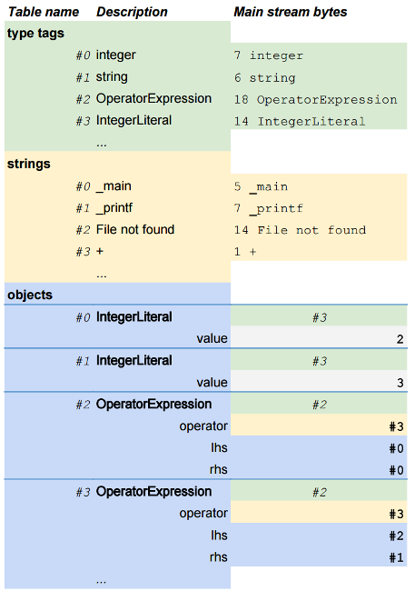
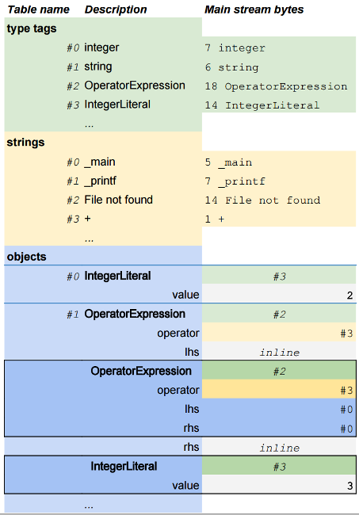
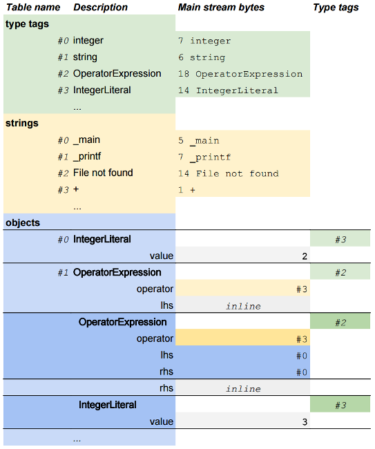
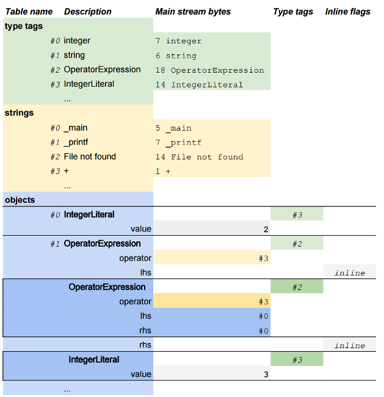
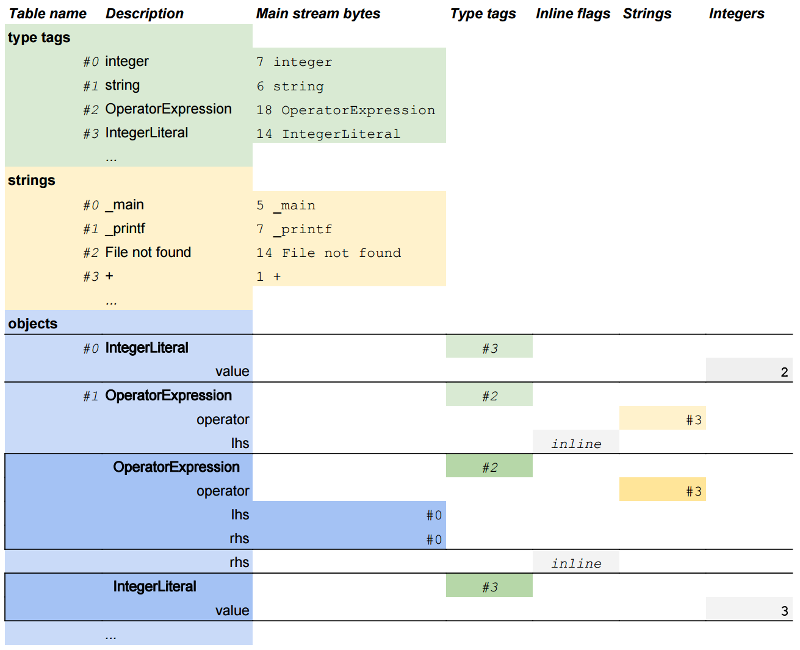

Layered binary encoding proposal
================================

The following is a proposal for a **layered binary encoding**, designed as a set of format improvements and optimizations layered on top of a simple base format. This approach allows simple encoders & decoders to leverage separate, re-usable compressors and decompressors without having to implement the entire format. It also provides a simple path for incremental improvements to compression ratio and decoding speed and adapts well to different scenarios.

Each layer represents small changes to the on-disk file format that enable a large set of encoder-side optimizations. A production implementation would implement the entirety of Layer 2 with simple fallback to handle Layer 0 and Layer 1 files. The overall process of decoding files is the same regardless of layer.

In testing, applying all the optimizations described below (full Layer 2) reduces the size of a [representative Layer 0 file](#f1) on-disk from **23,455KiB** down to **3,389KiB**.
Stream-compressed results are even more significant, with the size post-GZIP decreasing from **6,716KiB** to **1,072KiB**, and the size post-LZHAM going from **4,499KiB** to **986KiB**.

The optimizations below do not just reduce file size - they also increase decoding speed **and reduce the amount of heap necessary to decode the file**. For the graph used in the above size tests, the amount of heap used to decode it from JSON is **262,717KiB**, the amount of heap used to decode it from Layer 0 is **177,741KiB**, and the amount of heap used to decode the fully-optimized Layer 2 file is **47,219KiB**, a reduction of **nearly 4x**. Decoding speed likewise increases.

Schemas
-------
Files in this format rely on a schema that describes all the node types that can appear in the file. This allows robust decoding even in the presence of new, unknown node types, and efficient decoding logic can be generated from the schema as needed. Schemas are small so they are embedded at the front of the file to ensure that decoding can occur without use of external resources.

Object table
------------
The foundation of the file format is the **object table**. The table contains a series of sequentially numbered objects. Each object is tagged with its schema type. Objects in the table refer to each other by index, which allows loading arbitrarily complex graphs in a single, non-recursive pass.

Constant tables
---------------
Paired with the object table are two constant tables, one for **type tags** and one for **strings**. Type tags are unique identifiers that map to individual object types in the schema. Types and strings are referred to by index (into the respective table) in the rest of the file.

Simple decoding
---------------
Every entry in the tables has a known size (for objects, based on the type in the schema; for tags and strings, based on a per-entry length header), simplifying the task of scanning through the file.

Simple encoding
---------------
A trivial encoder need only emit the three layer 0 tables. Optimizations can be applied after-the-fact as needed, or omitted entirely (i.e. for debug mode and JIT scenarios)

-

Layer 0
=======
A layer 0 file contains the type tag table, the string table, and the object table. No constraints are applied to the order of the tables or to their contents. This tiny feature set (referred to as **Layer 0**) is the base of the layered file format.

The diagram below illustrates a possible Layer 0 encoding of the expression ```(2 + 2) + 3```.


Deduplication
-------------
An encoding technique that requires no changes to the decoder, **deduplication** (sometimes referred to as **nullary macros**) is essential to efficient use of a table-based format. The deduplication technique identifies identical objects and strips them from the object table, resulting in a sigificantly smaller file and reduced number of object instances created when decoding. Similar deduplication can occur for the string table to reduce its size.

On representative JavaScript files from large applications, 70% or more of of all nodes are deduplicated.

-

Layer 1
=======
**Layer 1** adds one additional format capability on top of Layer 0, the ability to store **entire graphs of objects inside a single table entry**, by writing them directly using a pre-order tree representation. For infrequently used objects this bypasses the overhead of storing them in the object table while increasing the compressibility of object indices (by shrinking the index space). When combined with deduplication, this produces a relatively small object table containing large subgraphs that are stitched together to create the complete graph.

A simple encoder can produce a Layer 1 file without any table-generation or deduplication passes, by generating an object table containing a single entry that represents the entire graph. This file will be smaller than a naive Level 0 encoding of the same graph, at the cost of the decoding process being recursive.

One downside to this approach is that a preorder encoded object needs to be preceded by a distinct tag. Layer 2 enables mitigations for this.

The diagram below illustrates a possible Layer 1 encoding of the expression ```(2 + 2) + 3```.


-

Layer 2
=======
**Layer 2** adds a building block to the format that enables a number of optimizations, **stream splitting**, also referred to as (**Structure of Arrays** representation, or **SoA**). The idea behind stream splitting is to take the various categories of values in the encoding and split them out into individual streams that are stored separately within the file, much like the existing distinction between the three (types, strings, objects) tables. With the exception of the header information that identifies the streams, **stream splitting does not increase file size**.

Type Tag Splitting
------------------
The most fundamental use of the stream splitting technique is **Type Tag Splitting**, where all the type tag values (headers in the object table, and type identifiers when pre-order encoding graphs) are moved to a separate stream. This dramatically improves compressibility and improves memory locality in some scenarios (for example, scanning/seeking within the file).

The diagram below illustrates a possible Layer 2 encoding of the expression ```(2 + 2) + 3``` using type tag splitting.


Preorder Encoded Object Tag Splitting
---------------------
A simple way to optimize the pre-order encoding is to move the associated tags out of the object bodies and into a separate table. As with type tag splitting, this optimization dramatically improves compressibility without the need for bit-packing or other optimizations, as every modern stream compressor will apply those techniques for us.



Field Splitting
---------------
Stream splitting can also be applied to the individual fields that comprise objects, splitting them by individual field or by value type. Clustering all integer literals, double literals, string references &c into their own streams dramatically increases compressibility.



Preorder Object Splitting
-------------------------
A naive implementation of the preorder encoding writes the entire object into the stream that would have otherwise contained an indexed reference. Preorder object splitting moves those inlined objects into separate streams, classified by type - the result is that each stream contains a sequence of objects, all of the exact same size and shape.

Intelligent table sorting
-------------------------
Another important encoding technique involves intelligent sorting of tables before writing them to the file. The most obvious ordering is to emit objects and strings in the order they appeared, but we can do better. By sorting **frequently used objects** to the front of the table, they are assigned smaller indices which reduces the size of those indices when they are compressed or written with a variable encoding.

Beyond this, one can select an arbitrary use-count threshold and classify all objects below that as **infrequently used objects**, and sort those sequentially or based on a locality heuristic. This increases the probability that indices will be sequential in the encoded file, further increasing compressibility.

-

Micro-optimizations
===================
Additional micro-optimizations can be applied to shave a few percentage points off post-compression file sizes or significantly shrink pre-compression sizes. These optimizations are largely separate from the layered approach.

Variable-length Integers
------------------------
A variable-length integer encoding like [LEB128](https://en.wikipedia.org/wiki/LEB128) can be used to encode table references and integer literals. This dramatically reduces the size of uncompressed files on disk and produces a compressed file size reduction (however, when Layer 2 optimizations have been applied **the size savings from variable-length integer encoding are extremely small**.) This optimization increases the complexity of decoding and causes almost all objects to have unknown sizes.

Null-terminated strings
-----------------------
Encoding the contents of the string table with null terminators instead of length headers provides a measurable size reduction for files containing a large string table, but this reduces decoding performance and prohibits the use of string literals that contain embedded nulls. (Splitting the length headers into a separate Layer 2 stream may be a superior alternative here, but has not been tested.)

-

Minutiae
--------

* <a name="f1">The representative file used for testing</a> is a full JavaScript parse tree for a minified version of the BananaBread emscripten demo. This is not directly comparable to Luke Wagner's bytecode prototype or to the size of raw JavaScript, as it encodes additional information not present in those two representations. However, once all Layer 2 optimizations have been applied, it is roughly the same size as the input JavaScript (both before and after stream compression), if not smaller. 
* This format accomplishes many of the same goals as JavaScript minification, so compression gains are more significant when used on an unminified JavaScript file.
* Compression results are similar (if not better) for the AngryBots demo.
